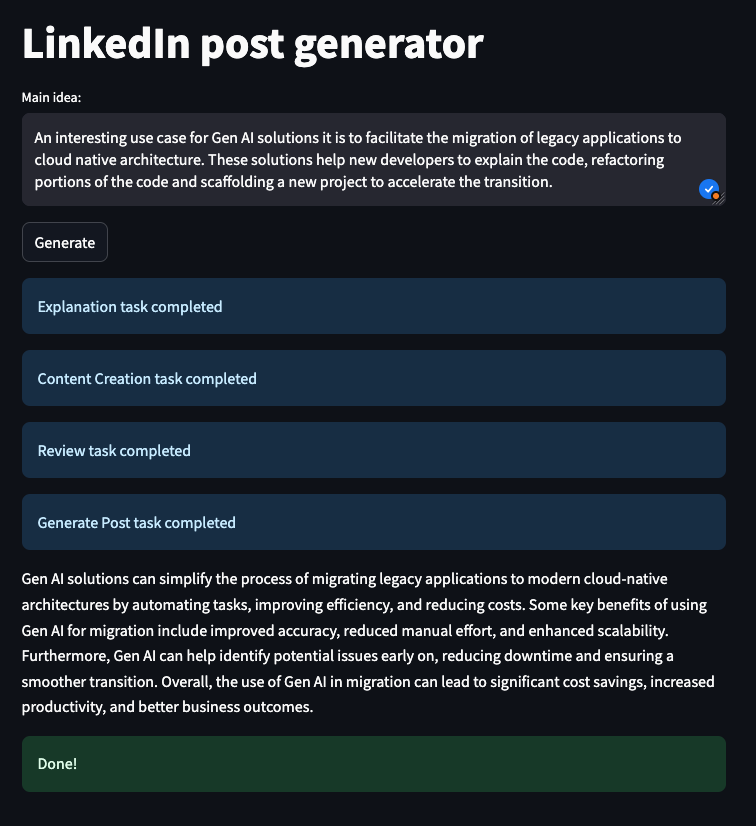

# LinkedIn post generator

<!-- markdown-link-check-disable-next-line -->

<!-- markdown-link-check-disable-next-line -->

## Summary

This application uses the [CrewAI framework](https://www.crewai.com/) to define
a marketing crew for generating LinkedIn posts from vague ideas. The CrewAI
framework enables the creation of scalable and efficient workflows for content generation.

